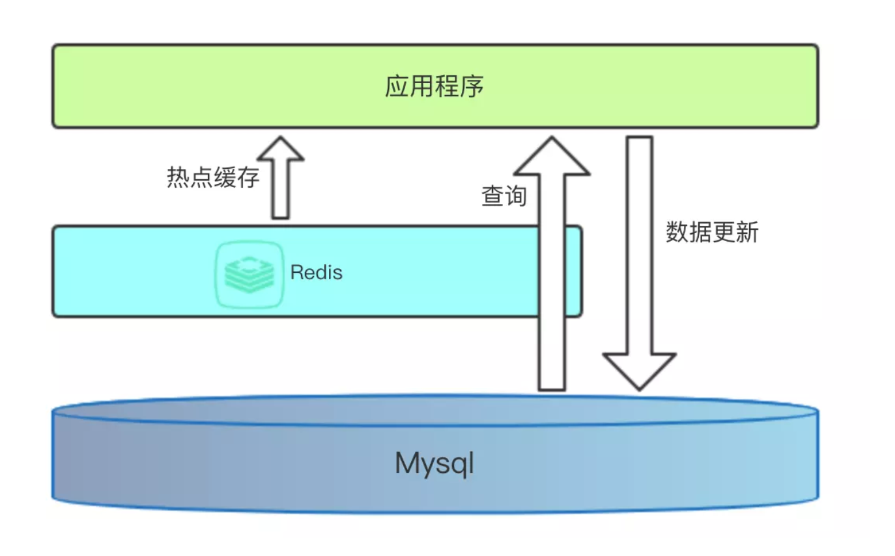

# 缓存

## 基本架构

1. 直观认知



2. 计算机体系结构中的缓存
3. 多级缓存


## 缓存数据

### 缓存数据的类型

哪些数据适合缓存，以提高访问速度？

- 一个数值
  - 如验证码（短信/图形验证码）
  - 如用户状态（sessionID）
  - 如SSO单点登录时的token/用户信息
  - ......
- 数据库记录
  - 频繁查询的数据
    - 如用户对象基本信息，采用redis Hash存储

  - 某个复杂SQL的查询结果
    - 如关联查询、条件查询交杂，可对SQL进行hash摘要作为key，查询结果作为value缓存入redis

- 一个视图的响应结果
  - 视图频繁被访问，返回结果固定、不依赖参数。可将请求url作为key，视图结果作为value缓存入redis

- 一个页面
  - 频繁访问的页面，后端渲染后，可将请求url作为key，html字符串作为value缓存入redis


### 缓存数据的保存方式

- 序列化字符串

  - 如用户信息，可序列化成json字符串再以string类型存入redis

    ```python
    setex('user:1:info', expiry, json.dumps(user_dict))
    ```

  - 优缺点

    - 存储字符串节省空间
    - 序列化有时间开销
    - 更新不方便（一般直接删除覆盖）

- redis其他数据类型，如list、hash、set、zset

  - 如用户信息，可用hash类型存入redis

    ```python
    hmset('user:1:info', user_dict)
    ```

  - 优缺点

    - 读写时不需要序列化转换
    - 可以更新内部数据
    - 相比字符串，采用复合结构存储空间占用大


## 缓存有效期与淘汰策略

### 有效期 TTL （Time to live)

设置有效期的作用：

1. 节省空间
2. 做到数据弱一致性，有效期失效后，可以保证数据的一致性

### 过期策略

通常有以下三种：

- **定时过期**

  每个设置过期时间的key都需要创建一个定时器，到过期时间就会立即清除。该策略可以立即清除过期的数据，对内存很友好；但是会占用大量的CPU资源去处理过期的数据，从而影响缓存的响应时间和吞吐量。

  ```python
    setex('a', 300, 'aval')
    setex('b', 600, 'bval')
  ```

- **惰性过期**

  只有当访问一个key时，才会判断该key是否已过期，过期则清除。该策略可以最大化地节省CPU资源，却对内存非常不友好。极端情况可能出现大量的过期key没有再次被访问，从而不会被清除，占用大量内存。

- **定期过期**

  每隔一定的时间，会扫描一定数量的数据库的expires字典中一定数量的key，并清除其中已过期的key。该策略是前两者的一个折中方案。通过调整定时扫描的时间间隔和每次扫描的限定耗时，可以在不同情况下使得CPU和内存资源达到最优的平衡效果。

  > expires字典会保存所有设置了过期时间的key的过期时间数据，其中，key是指向键空间中的某个键的指针，value是该键的毫秒精度的UNIX时间戳表示的过期时间。键空间是指该Redis集群中保存的所有键。

### Redis的过期策略

**Redis中同时使用了惰性过期和定期过期两种过期策略。**

Redis过期策略首要采用的是定期清除策略，默认每100ms检测一次，遇到过期的key则进行删除，这里的检测并不是顺序检测，而是随机检测。

这样会有部分遗漏。于是采用惰性删除策略消除可能的遗漏，即当我们去读/写一个已经过期的key时，会触发惰性删除策略检测，若过期则直接清除

**为什么不用定时删除策略?**

定时删除，用一个定时器来负责监视key，过期则自动删除。

虽然内存及时释放，但是十分消耗CPU资源。在大并发请求下，CPU要将时间应用在处理请求，而不是删除key，因此没有采用这一策略。

**定期删除 + 惰性删除是如何工作的呢?**

定期删除，redis默认每隔100ms检查，是否有过期的key，有过期key则删除。需要说明的是，redis不是每个100ms将所有的key检查一次，而是随机抽取进行检查(如果每隔100ms,全部key进行检查，redis岂不是卡死)。因此，如果只采用定期删除策略，会导致很多key到时间没有删除。

于是，惰性删除派上用场。也就是说在你获取某个key的时候，redis会检查一下，这个key如果设置了过期时间那么是否过期了？如果过期了此时就会删除。

采用定期删除+惰性删除就没其他问题了么?

不是的，如果定期删除没删除key。然后你也没即时去请求key，也就是说惰性删除也没生效。这样，redis的内存会越来越高。那么就应该采用内存淘汰机制。

### 缓存淘汰 eviction

**Redis自身实现了缓存淘汰**

Redis的**内存淘汰策略**是指在Redis用于缓存的内存不足时，怎么处理需要新写入且需要申请额外空间的数据。

- noeviction：当内存不足以容纳新写入数据时，新写入操作会报错。
- allkeys-lru：当内存不足以容纳新写入数据时，在键空间中，移除最近最少使用的key。
- allkeys-random：当内存不足以容纳新写入数据时，在键空间中，随机移除某个key。
- volatile-lru：当内存不足以容纳新写入数据时，在设置了过期时间的键空间中，移除最近最少使用的key。
- volatile-random：当内存不足以容纳新写入数据时，在设置了过期时间的键空间中，随机移除某个key。
- volatile-ttl：当内存不足以容纳新写入数据时，在设置了过期时间的键空间中，有更早过期时间的key优先移除。

**redis 4.x 后支持LFU策略，最少频率使用**

- allkeys-lfu
- volatile-lfu

#### LRU

LRU（Least recently used，最近最少使用）

LRU算法根据数据的历史访问记录来进行淘汰数据，其核心思想是“如果数据最近被访问过，那么将来被访问的几率也更高”。

基本思路

1. 新数据插入到列表头部；
2. 每当缓存命中（即缓存数据被访问），则将数据移到列表头部；
3. 当列表满的时候，将列表尾部的数据丢弃。

#### LFU

LFU（Least Frequently Used 最近最少使用算法）

它是基于“如果一个数据在最近一段时间内使用次数很少，那么在将来一段时间内被使用的可能性也很小”的思路。


**LFU需要定期衰减。**

### Redis淘汰策略的配置

- maxmemory 最大使用内存数量
- maxmemory-policy noeviction 淘汰策略


## 缓存模式

1. Cache Aside

   更新方式

   - 先更新数据库，再更新缓存。两个并发的写操作会导致脏数据。
   - 先删除缓存，再更新数据库。这个逻辑是错误的。因为两个并发的读和写操作导致脏数据。
   - 先更新数据库，再删除缓存。理论上有极低的概率在并发读写上出现脏数据。

2. Read-through 通读

3. Write-through 通写

4. Write-behind caching

#### 头条项目方案

- 使用Read-throught + Cache aside
  - 构建一层抽象出来的缓存操作层，负责数据库查询和Redis缓存存取，在Flask的视图逻辑中直接操作缓存层工具。
- 更新采用先更新数据库，再删除缓存


## 缓存的问题

#### 缓存穿透

频繁去访问缓存中没有的数据，那么缓存就失去了存在的意义，瞬间所有请求的压力都落在了数据库上，这样会导致数据库连接异常。

解决方案：

- 对于返回为NULL的依然缓存，对于抛出异常的返回不进行缓存。这种手段的会增加我们缓存的维护成本，需要在插入缓存的时候删除这个空缓存，当然我们可以通过设置较短的超时时间来解决这个问题。
- 制定一些规则过滤一些不可能存在的数据，小数据用**BitMap**，大数据可以用**布隆过滤器**，比如你的订单ID 明显是在一个范围1-1000，如果不是1-1000之内的数据那其实可以直接给过滤掉。

#### 缓存雪崩

指缓存不可用或者大量缓存由于超时时间相同在同一时间段失效，大量请求直接访问数据库，数据库压力过大导致系统雪崩。

解决方案：

- 给缓存加上一定区间内的随机生效时间，不同的key设置不同的失效时间，避免同一时间集体失效。比如以前是设置10分钟的超时时间，那每个Key都可以随机8-13分钟过期，尽量让不同Key的过期时间不同。
- 采用多级缓存，不同级别缓存设置的超时时间不同，即使某个级别缓存都过期，也有其他级别缓存兜底。
- 利用加锁或者队列方式避免过多请求同时对服务器进行读写操作。


## 头条项目缓存与存储设计

### 缓存设计

1. #### User Cache

   用户基本资料

   |          key           |  类型  |                      说明                       | 举例 |
   | :--------------------: | :----: | :---------------------------------------------: | :--: |
   | user:{user_id}:profile | string | user_id用户的数据缓存，包括手机号、用户名、头像 |      |

   用户扩展资料

   |           Key           |  类型  |          说明          | 举例 |
   | :---------------------: | :----: | :--------------------: | :--: |
   | user:{user_id}:profilex | string | user_id用户的性别 生日 |      |

   用户状态

   |          Key          |  类型  |        说明         | 举例 |
   | :-------------------: | :----: | :-----------------: | :--: |
   | user:{user_id}:status | string | user_id用户是否可用 |      |

   |           Key            | 类型 |       说明        |           举例           |
   | :----------------------: | :--: | :---------------: | :----------------------: |
   | user:{user_id}:following | zset | user_id的关注用户 | [{user_id, update_time}] |

   |         Key         | 类型 |       说明        |           举例           |
   | :-----------------: | :--: | :---------------: | :----------------------: |
   | user:{user_id}:fans | zset | user_id的粉丝用户 | [{user_id, update_time}] |

   |        Key         | 类型 |     说明      |            举例             |
   | :----------------: | :--: | :-----------: | :-------------------------: |
   | user:{user_id}:art | zset | user_id的文章 | [{article_id, create_time}] |

2. #### Comment Cache

   |           key           |  类型  |                     说明                     |             举例              |
   | :---------------------: | :----: | :------------------------------------------: | :---------------------------: |
   |  art:{article_id}:comm  |  zset  | article_id文章的评论数据缓存，值为comment_id |  [{comment_id, create_time}]  |
   | comm:{comment_id}:reply |  zset  | comment_id评论的评论数据缓存，值为comment_id | [{'comment_id', create_time}] |
   |    comm:{comment_id}    | String |                缓存的评论数据                |                               |

   

3. #### Article Cache

   |           key           |  类型  |      说明      |          举例  |
   | :---------------------: | :----: | :-----------: | :-----------: |
   |         ch:all          | string |    所有频道    |                |
   |    user:{user_id}:ch    | string |    用户频道    |                |
   | ch:{channel_id}:art:top |  Zset  |    置顶文章    | [{article_id, sequence}] |
   |  art:{article_id}:info  | string | 文章的基本信息 |                 |
   | art:{article_id}:detail | string |   文章的内容   |                |

   

4. #### Announcement Cache

   | key | 类型 | 说明 |  举例 |
   | :--: | :--: | :--: | :--------: |
   | announce | zset |   | [{'json data', announcement_id}] |
   | announce:{announcement_id} | string |  |  'json data' |


### 持久存储设计

#### 阅读历史

|            key             | 类型 | 说明 |           举例            |
| :------------------------: | :--: | :--: | :-----------------------: |
| user:{user_id}:his:reading | zset |      | [{article_id, read_time}] |

#### 搜索历史

|             key              | 类型 | 说明 |           举例           |
| :--------------------------: | :--: | :--: | :----------------------: |
| user:{user_id}:his:searching | zset |      | [{keyword, search_time}] |

#### 统计数据

|         key          | 类型 |       说明       |         举例          |
| :------------------: | :--: | :--------------: | :-------------------:|
|  count:article:reading  | zset |   文章阅读数量   | [{article_id, count}] |
|   count:user:arts    | zset | 用户发表文章数量 |  [{user_id, count}]   |
| count:article:collecting | zset |   文章收藏数量   | [{article_id, count}] |
|   count:article:liking   | zset |   文章点赞数量   | [{article_id, count}] |
|    count:article:comm    | zset |   文章评论数量   | [{article_id, count}] |


